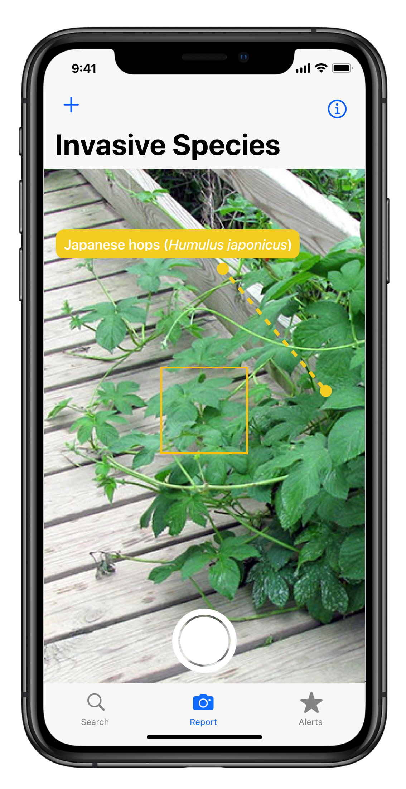

## The Invasive Species Reporting App
A big goal of this iniative is to make it easy for everyone to participate in the fight against invasive
species. To encourage this, our team designed a mobile app that would allow users to report invasive species
that they encounter in their everyday lives.

The app's three main capabilities would be allowing the user:
- Search for invasive species sightings nearby
- Identify and report invasive species 
- Stay informed with local alerts about invasive species

### Design
The app was designed in accordance with [Apple's Human Interface Guidelines](https://developer.apple.com/design/human-interface-guidelines/ios/overview/themes/) 
to offer users a clearly designed and accessible app that makes reporting invasive species and staying up 
to date with local invasive species alerts as simple as possible.
